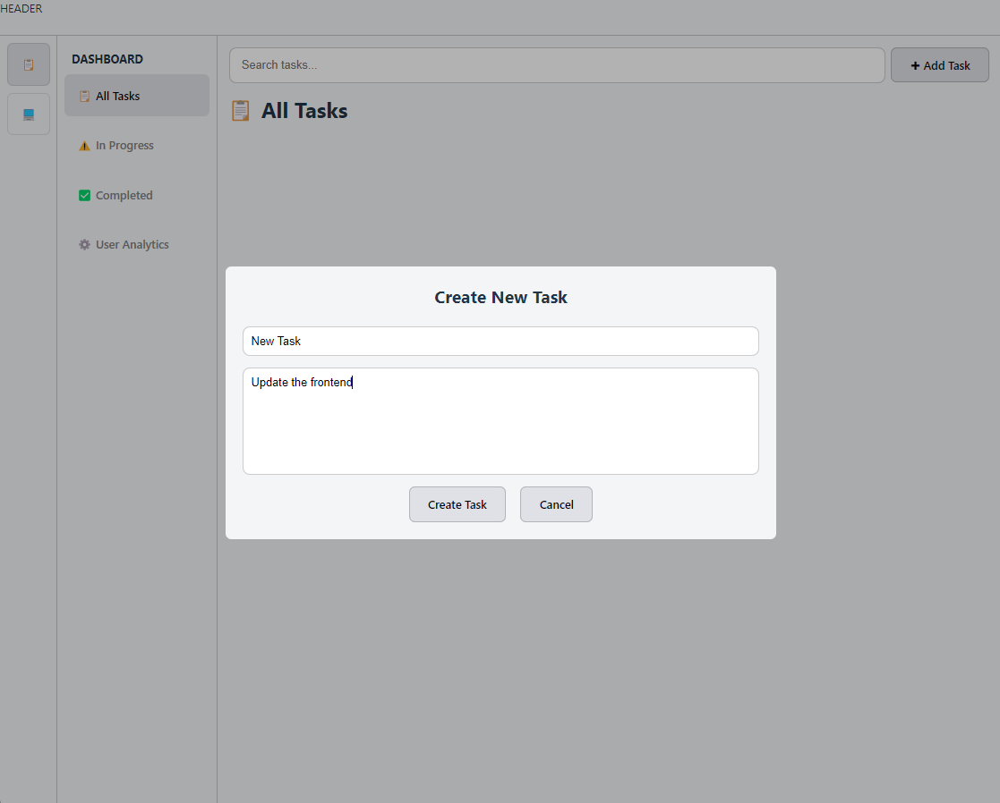
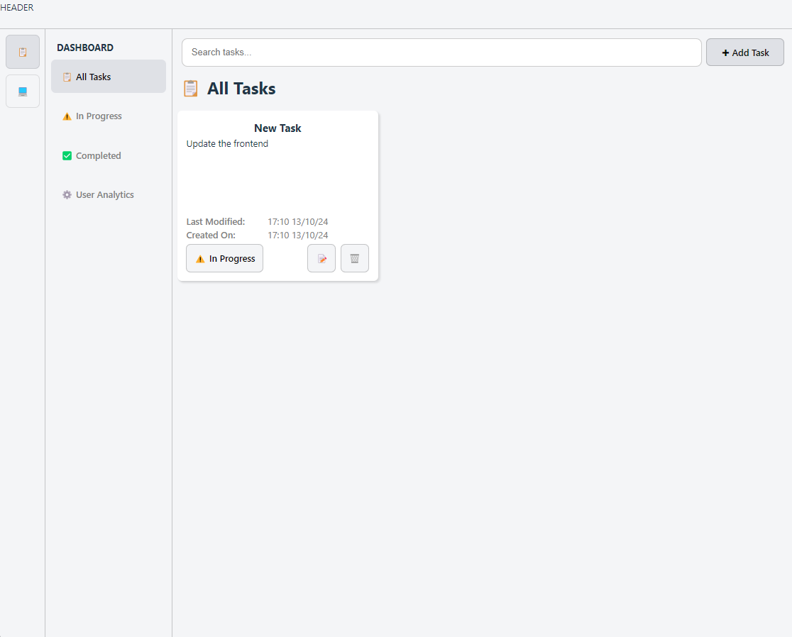
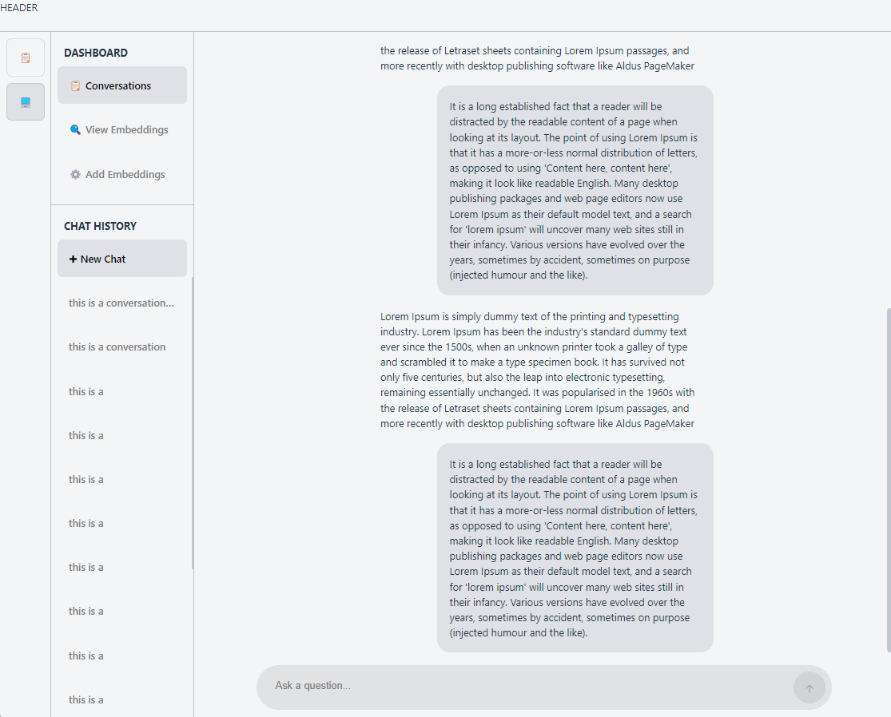
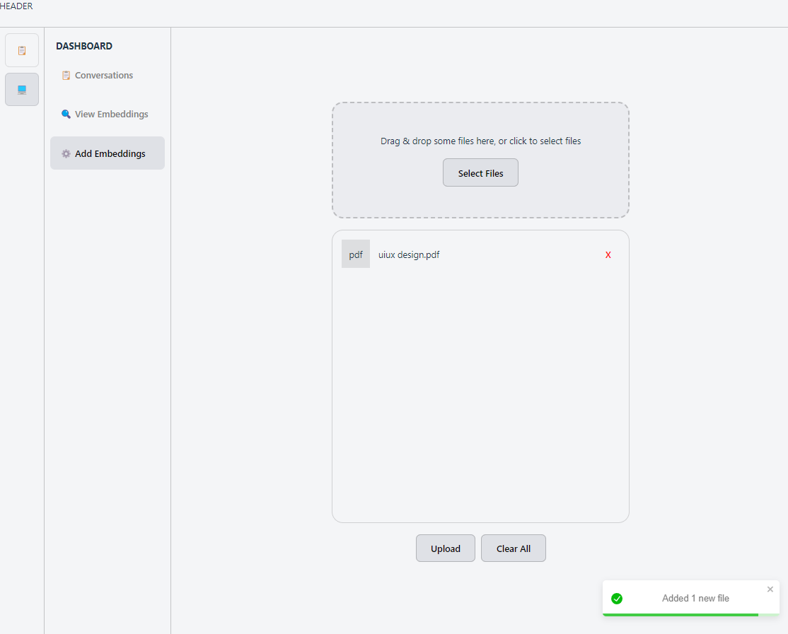
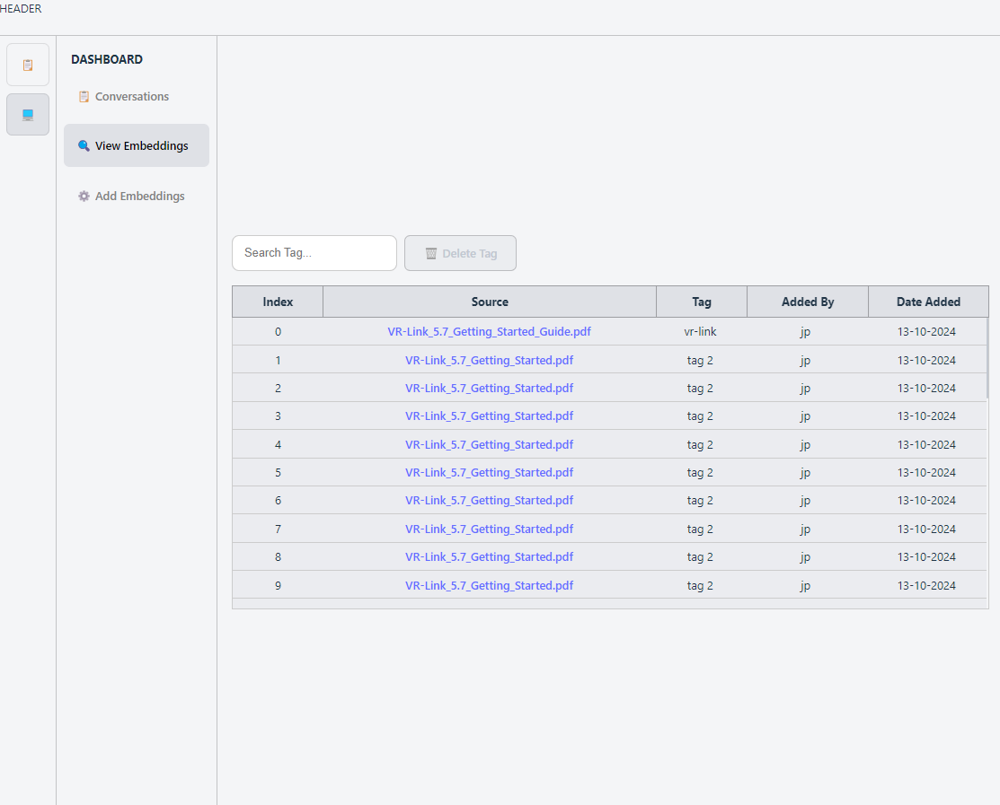

# User Dashboard Frontend

Soba AI is a Task Management and Local LLM platform built with **React and TypeScript**. This application is designed to streamline your workflow and provide valuable insights into your productivity, leveraging the power of RAG and LLM technology.

Soba AI is a powerful tool that combines task management, document organization, and AI-powered insights to help you stay on top of your work. By leveraging the power of RAG technology, our platform provides a more accurate and informative way to manage your tasks and documents, and gain valuable insights into your productivity.

## Features

### Task Management:

Organize your tasks using a intuitive card system, with the ability to track progress and mark tasks as completed.

### Task Summary Generation:

Automatically generate summaries of your tasks for the current week, month, or year using a local Language Model (LLM) that can retrieve relevant information from a centralized database.

### LLM Conversations:

Engage in conversations with our LLM and view conversation history on a dedicated page.

### Document Upload and Retrieval:

Upload documents to our centralized database, which can be retrieved by the LLM to inform its responses and provide more accurate summaries.

### RAG-Powered Insights:

Our local LLM uses the uploaded documents to generate more accurate and informative summaries, providing you with valuable insights into your tasks and productivity.
Overview

## Some Screenshots

